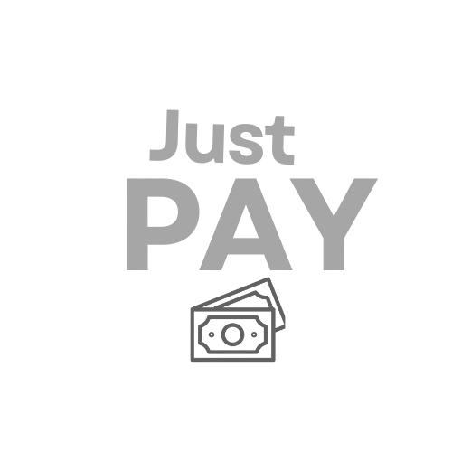

<p align="left">
  
  
  
  
  
  
</p>

## Overview

This project is a **stablecoin payment DApp** that allows users to send payments to friends within their contact list. It uses **Privy** for seamless authentication, **viem** for blockchain interactions, **Next.js** for a fast and responsive client-side interface, and features a clean, refined UI for an intuitive user experience.

## Features

- **User Authentication**: Seamless and secure authentication using Privy.
- **Stablecoin Payments**: Easily send payments to friends within your contact list.
- **Smart Contracts**: Written in Solidity for blockchain interactions.
- **Payment Requests**: Request payments from friends with just a few clicks.
- **Responsive UI**: A clean and modern interface built with Next.js.

## Setup Instructions

### Prerequisites

Before you begin, ensure you have the following installed:

- **Node.js** (v16 or higher)
- **npm** or **yarn** (Node.js package managers)
- **Git** (for cloning the repository)
- **Foundry** (for smart contract development and testing)
- **MetaMask** or any Ethereum wallet (for interacting with the DApp)

### Installation

1. **Clone the Repository**

   - Open your terminal or command prompt.
     ```bash
     git clone https://github.com/claudioussamuel/JustPay
     ```
     ```bash
     cd frontend
     ```

2. **Install Dependencies**
   - Install all required dependencies by running:
     ```bash
     npm install
     ```
     or if you're using Yarn:
     ```bash
     yarn install
     ```
3. **Set Up Environment Variables**
   - Create a `.env.local` file in the root directory of the project.
   - Add the following environment variables:
     ```env
     NEXT_PUBLIC_PRIVY_APP_ID=your_privy_app_id
     NEXT_PUBLIC_PRIVY_APP_SECRET=your_privy_secret_key
     NEXT_PUBLIC_SEPOLIA_ID=your_alchemy_api_key
     ```
     - Replace `your_privy_app_id` with your actual Privy App ID (get it from the [Privy Dashboard](https://privy.io/)).
     - Replace `your_alchemy_api_key` with your Alchemy API key (if you're using Alchemy for Ethereum node access).

### Usage

0. **Mint Test ERC20 Tokens**

   - Before interacting with the DApp, you'll need to mint test ERC20 tokens from this address:
     ```
     0xd484a0463a540E59Ff10954F74c2ec2efd785abc
     ```
   - Connect your wallet to the appropriate testnet and interact with this contract to mint tokens.
   - These tokens will be used for testing payment functionality within the DApp.

1. **Connect Your Wallet**

   - Click the **Connect Wallet** button on the homepage.
   - Use **Privy** to authenticate and link your Ethereum wallet (e.g., MetaMask).

2. **Add Friends to Your Contact List**

   - Navigate to the **Contacts** section.
   - Add friends by entering their wallet addresses or usernames.

3. **Send Payments**

   - Go to the **Send Payment** section.
   - Select a friend from your contact list and enter the amount.
   - Confirm the transaction in your wallet.

4. **Request Payments**

   - Go to the **Request Payment** section.
   - Select a friend and specify the amount.
   - Your friend will receive a payment request notification.

5. **View Transaction History**
   - Check the **Transaction History** section to view all sent and received payments.

---

### Additional Notes

- **Smart Contracts**:

  - The project uses **Foundry** for smart contract development, testing, and deployment.
  - Compile, test, and deploy contracts:

    ```bash
    # Compile contracts
    forge build

    # Run tests
    forge test

    # Deploy contracts
    forge script script/Deploy.s.sol --rpc-url <your_rpc_url> --private-key <your_private_key>
    ```

- **Wallet Integration**:

  - The project uses **viem** with **Privy** for wallet connections and blockchain interactions.
  - This combination provides a streamlined user experience while maintaining security.

- **Testing the DApp**:
  - Use testnet stablecoins (e.g., USDC on Sepolia) to simulate payments.
  - Ensure your wallet is connected to the correct Ethereum network (e.g., Sepolia Testnet).

---

### Troubleshooting

- **Environment Variables**: Ensure all required environment variables are set in `.env.local`.
- **Wallet Connection**: If the wallet fails to connect, ensure your wallet (e.g., MetaMask) is installed and unlocked.
- **Transaction Issues**: If transactions fail, check your wallet balance and network connection.
- **Foundry Issues**: Make sure Foundry is properly installed and updated to the latest version.
